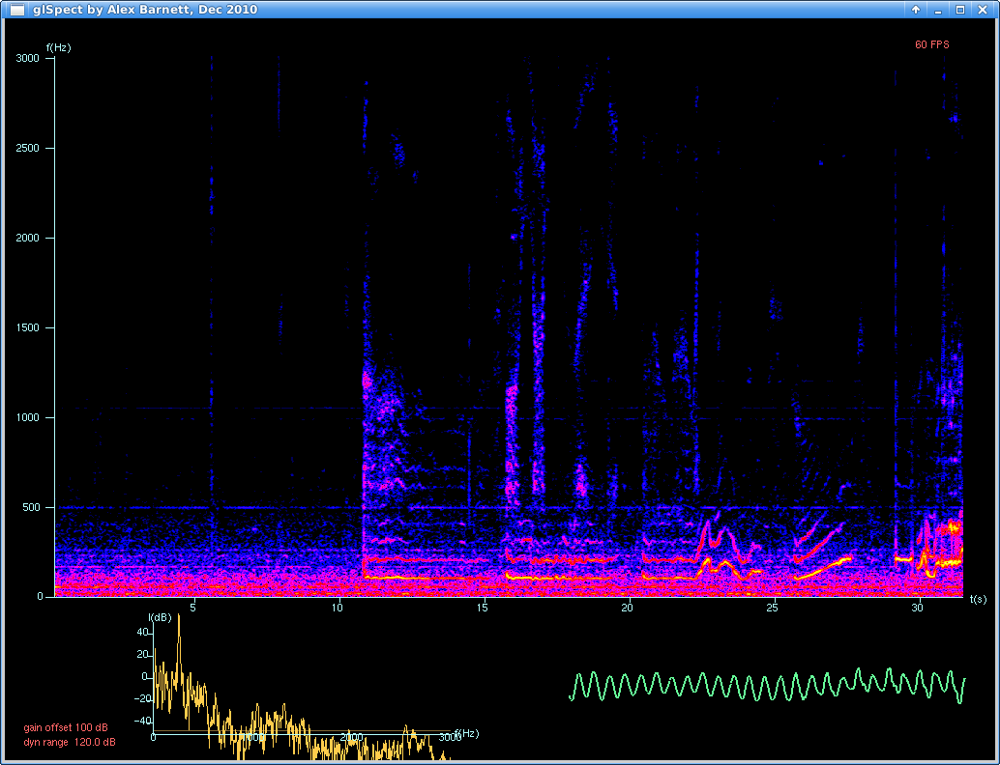

# glspect

Real-time audio spectrogram in OpenGL

Alex Barnett, Mathematics Dept, Dartmouth College, and Flatiron Institute,
Simons Foundation.
					ahb@math.dartmouth.edu

Original release: December 2010, updated Jan 2015, moved to github 3/15/17.



This is a simple real-time spectrogram using OpenGL, GLUT, and ALSA.
It displays a scrolling window showing a "player piano roll" of the recent audio received by the microphone, with frequency on the vertical axis, and time on the horizontal.
It is excellent for demonstrating many acoustic phenomena such as vocal formants, resonance, doppler shifts, vibrational frequencies of instruments and metallic objects, timbre (harmonic content), etc.
The color range and contrast, as well as the time scroll rate, are adjustable
in real time. The frequency range is command-line adjustable in powers of 2.
Smaller windows at the bottom display real-time graphs of the spectrum and the
signal.
I originally created this code to help teaching <a href="http://math.dartmouth.edu/~m5f10">Math 5: The Mathematics of Music and Sound</a>


### Installation

This assumes an ubuntu linux system (the below is most recently tested on 16.04 LTS). Insure you have the dependencies installed (FFTW3, GLUT, ALSA):

`sudo apt-get install freeglut3 freeglut3-dev libfftw3-dev libasound2 libasound2-dev`

Now compile via `make` (although the binary is also shipped, so you may not need to compile)

Run with `./glspect`

You should see a colorful window pop up which scrolls to the left and shows `60 FPS` (or something close) in the top right.
You will also want to enable vSync (vertical refresh) in your graphics card settings (for my machine, this menu is reached via `nvidia-settings`).  If your
refresh rate is not 60 Hz, you should change this manually in the code
and recompile (sorry; this could be made into an option in future).

I have also bundled a tweaked version of `glscope` by Luke Campagnola in 2005; see the directory `glscope`. It has the same dependencies apart from FFTW.


### Usage:

```
glspect  [-f] [-v] [-sf <scroll_factor>] [-w <windowtype>] [-t <twowinsize>]

Command line arguments:
windowtype =    0 (no window) (will be crappy)
                1 (Hann)
                2 (Gaussian trunc at +-4sigma) (default, recommended)
scroll_factor = 1,2,...   How many vSyncs (@ 60Hz) to wait per scroll pixel
                  (default 1)
twowinsize = 11,12,...,16  is the power of 2 giving FFT win_size N (default 13)
        (Note: this controls the vertical frequency resolution and range)

Keys & mouse:   arrows or middle button drag - brightness/contrast
       		i - step through colormaps (B/W, inverse B/W, color)
                q or Esc - quit
                [ and ] - control horizontal scroll factor (rate)
```

### Bug reports

Please submit an Issue to github, or contact me at the above email address.

### To do

* replace the useful `glDrawPixels` by its annoying modern OpenGL equivalent: a pair of textured triangles (I don't know how to do this; see notes below)
* marking and playback (variable speed?) of selections, saving of recent audio
* real-time change of frequency range (win_size) ... but annoying
* option to match various refresh rates other than 60Hz
* stop the CPU usage when paused or, worse, offscreen (hits 100% usage if no limt on refresh rate!)
* better docs
* ports to Mac OSX, Windows
* see comments in `glspect.cpp` for more issues to fix

Please submit a pull request if you fix one of these!


### License

It is distributed under a completely free license; this means you can do
absolutely anything you want with this code. I'd appreciate if you
credit me where appropriate, though.


### Acknowledgments and notes

I discovered in Jan 2015 that `glDrawPixels` is deprecated in OpenGL >3.0,
which is bad news - if someone figures out how to replace it, let me know,
or please fix the code and submit a pull request.

CPU usage:
With `default scroll_factor=2`, CPU usage is less than 50% of one core of a modern intel i7 CPU.
With scroll_factor=1 (fastest scrolling), this may go up to 75%. If your CPU or GPU is not as fast as this, you might want to shrink n_f and/or n_tw in the code.

The code is somewhat based upon that of `glScope` by Luke Campagnola (2005).

It is also influenced by `baudline` (an amazing tool, which unfortunately has the time and frequency axes flipped).

Here's some useful info taken from Luke's `glScope README` file (see the `glscope` directory in this repo):

```
Since there is no interface to change the audio input device that is
displayed, you'll actually have to change some code if you want any
other channel besides the default recording device. The important line
in the code looks like this: 

pcm_name = strdup("plughw:0,0");

I guess you'll have to read about ALSA to figure out how to change 
that string.
```

Note that in Aug 2016, Anthony Agnone created a branch of this code:
https://github.com/aagnone3/audio_visualization
